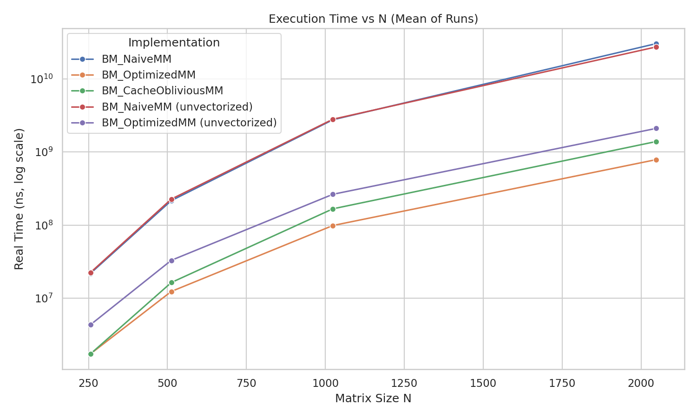
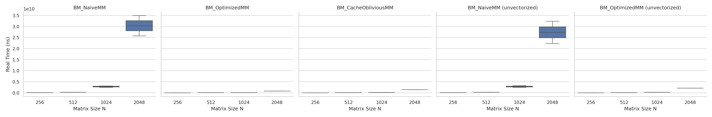
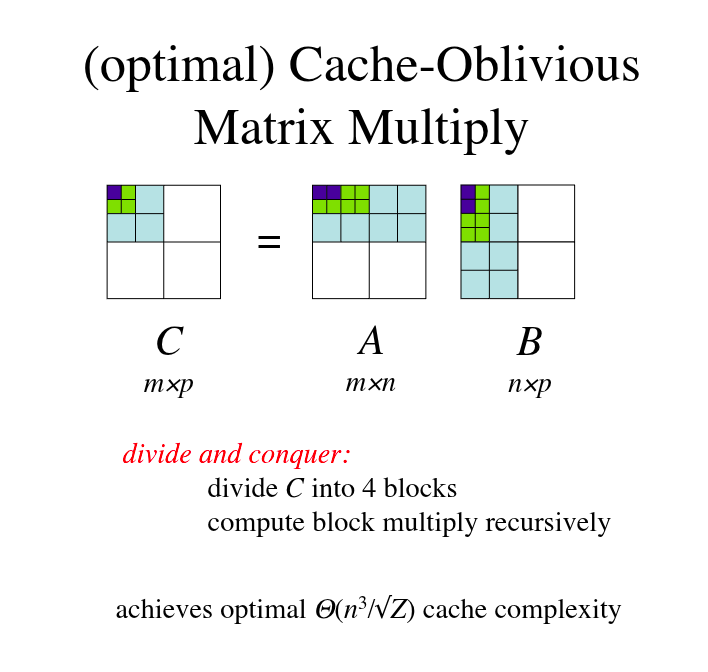
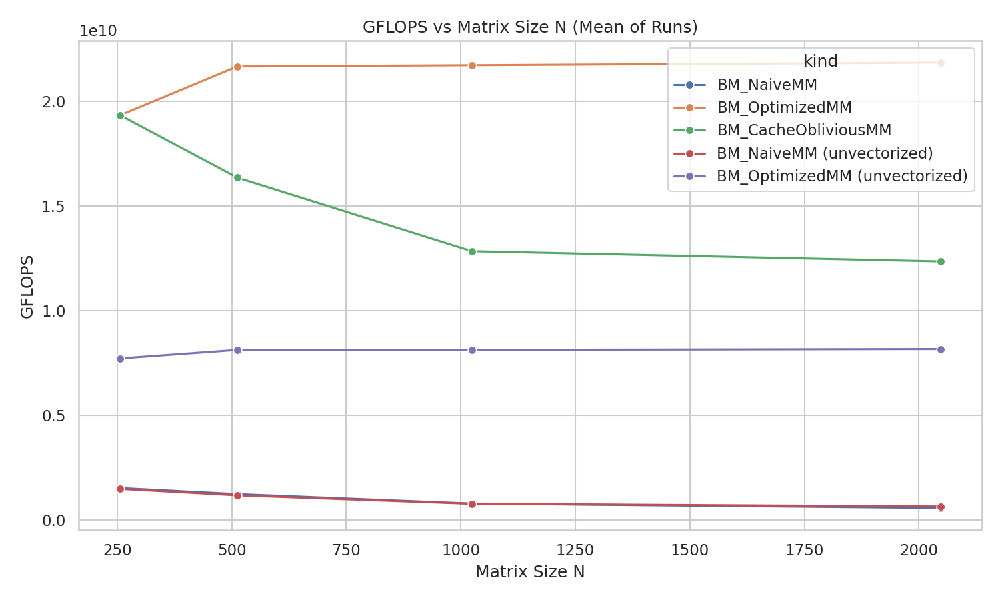
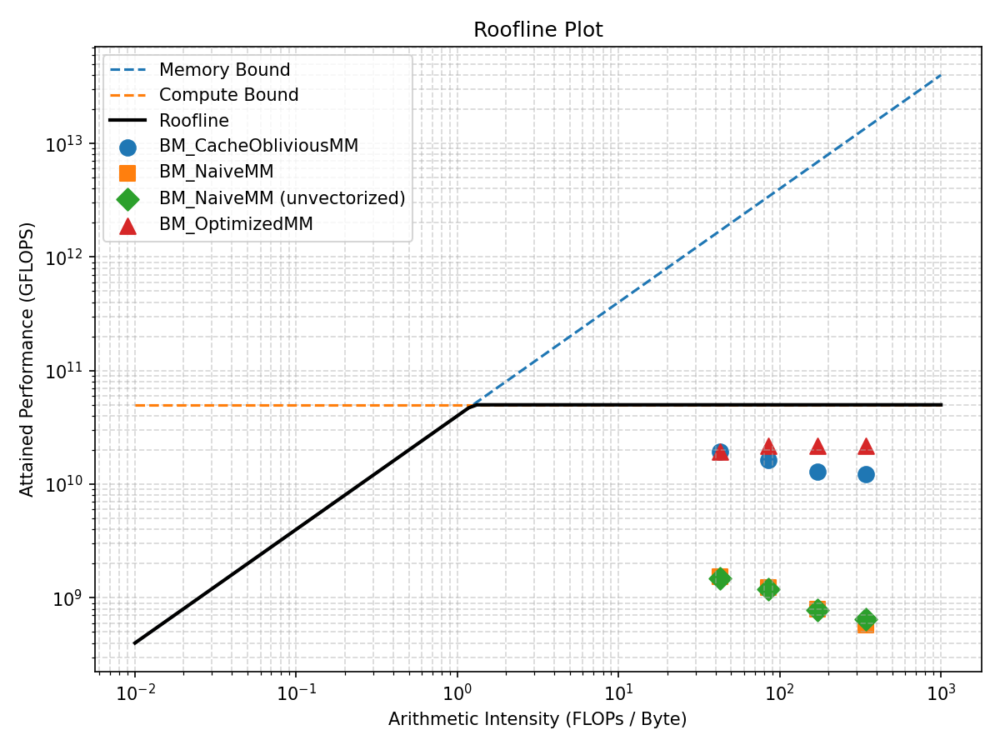
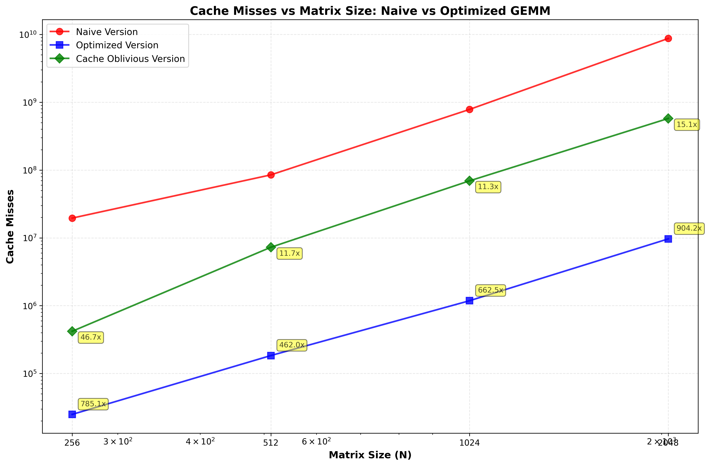

## Optimizing Matrix Multiplication

The source code can be found at [https://github.com/yashjha123/gemm_optimized](https://github.com/yashjha123/gemm_optimized)

The widespread use of matrix multiplication algorithms in many scientific computing applications demands optimized implementations for their use cases. Matrix multiplication is defined as the product of two matrices, running operations across three dimensions. Fortunately, modern computer hardware provides excellent support for achieving significant performance gains. Realizing these performance improvements requires code that can leverage available resources and optimize memory usage, leading to better cache utilization, reduced memory bandwidth requirements, and improved parallelism—all working together to solve this optimization challenge.  While the algorithm's complexity cannot be improved beyond O(n³) (or O(n^2.7) with Strassen's algorithm) and cannot be reduced asymptotically, the next best approach will be to maximize efficient use of available hardware resources.

Final optimized code is in the `lvl3_optimized_gemm.c` file, which contains the final implementation of the optimized GEMM algorithm. You can compile
the benchmark using the following command:
```bash

clang++ bench_gemm.cc -x c  constants_runtime.c \
    -x c lvl3_optimized_gemm.c -x c  utils.c  \
    -x c lvl0_naive_gemm.c \
  -Iinclude -O3 -DNDEBUG -march=native -mfma -ffast-math -mavx2 -funroll-loops \
  -D_POSIX_C_SOURCE=200112L \
  -isystem benchmark/include \
  -Lbenchmark/build/src -lbenchmark \
  -lbenchmark -lpthread -lrt \
  -o bench_gemm
```
OR
run
```
bash run.sh
```
to reproduce all the tests and benchmarks.

Other tools used, include, ``google benchmark``,  ``perf stat``, ``valgrind cachegrind`` and ``valgrind`` as a mix of tools to help quantify the validity and  th reliability of the optimized version. The results produced below are made using ``python`` and ``matplotlib``. 


The operation is defined as 

``C += A@B``

Where ``A`` is defined as a square matrix of size ``N x N``
        ``B`` is also a square matrix of size ``N x N``
        ``C`` is the result of the operations is also of size ``N x N``

## How fast are we talking about?
<!--  -->

<br />
<!--  -->

<br />
Results show the optimizations provide a 45.1x speed-up over the naive implementation, with the optimized version running at 2.25 GFLOPS for a matrix size of 1024x1024. The naive implementation runs at 0.05 GFLOPS for the same matrix size.

This is possible due to the optimizations made to the algorithm, which include loop reordering, blocking, and micro-kernel optimizations. The optimized version also takes advantage of the CPU's cache hierarchy, allowing for better cache usage and reduced memory bandwidth.


## Here is a naive implementation

```cpp
    for (int i = 0; i < N; i++){
        for (int j = 0; j < N; j++){
            for (int k = 0; k < N; k++){
                C[index(i, j)] += A[index(i, k)] * B[index(k, j)];
            }
        }
    }
```

3 Loops define the order of the operations across A and B. A is iterated in a row major format, B, the column-major wise. C is also row-major. With the varying sizes of the A, B and C, the larger arrays don't fit in the CPU's natural high-bandwith cache. A column-walks means loads of strided-N access where we use only one element and throw away the rest. The resulting high cache-miss, mean loss in opportunties that we could have gained. 


## Loop Reordering - Column-wise to Row-wise
Reordering the loops to iterate through the rows of B over a broadcast of A, allows for better cache usage. Simplest way to do this is by switching the order of the loops, from i->j->k to i->k->j. This allows for better cache usage, as we are now accessing the rows of B in a contiguous manner, which is more cache-friendly.

```cpp
    for (int i = 0; i < N; i++){
        for (int k = 0; k < N; k++){
            for (int j = 0; j < N; j++){
                C[index(i, j)] += A[index(i, k)] * B[index(k, j)];
            }
        }
    }
```
Here are some minute tests I ran for varying orders of the loops, and their respective timings. The results show that the order of the loops can have a significant impact on the performance of the matrix multiplication algorithm.

N = 1024 for all the tests, and the timings are in seconds.
```
Order	Time(s)
i,j,k	3.96
k i j	2.62
j,k,i	5.30
i,k,j	2.60
k,j,i	5.51
j,i,k	4.00
```
## Blocking / Loop Tiling
Huge optimization enhancment is achieved by blocking the matrix multiplication. This involves breaking down the matrices into smaller blocks, which fit into the CPU's cache. This allows for better cache usage and reduced memory bandwidth. The blocking size is determined by the cache size of the CPU.

```cpp
    for (int i = 0; i < N; i += BLOCK_SIZE){
        for (int j = 0; j < N; j += BLOCK_SIZE){
            for (int k = 0; k < N; k += BLOCK_SIZE){
                for (int ii = i; ii < std::min(i + BLOCK_SIZE, N); ii++){
                    for (int jj = j; jj < std::min(j + BLOCK_SIZE, N); jj++){
                        for (int kk = k; kk < std::min(k + BLOCK_SIZE, N); kk++){
                            C[index(ii, jj)] += A[index(ii, kk)] * B[index(kk, jj)];
                        }
                    }
                }
            }
        }
    }
```

The following table shows the performance of the blocked_gemm operation for differernt block sizes. The performance is measured in execution time in seconds for a matrix size of 1024x1024.
<table>
<tr>
<th>Block Size</th>
<th>1</th>
<th>2</th>
<th>4</th>
<th>8</th>
<th>16</th>
<th>32</th>
<th>64</th>
<th>128</th>
<th>256</th>
<th>512</th>
</tr>
<tr>
<th>N=1024</th>
<th>5.60</th>
<th>5.77</th>
<th>5.09</th>
<th>3.97</th>
<th>3.77</th>
<th>3.73</th>
<th>3.65</th>
<th>3.50</th>
<th>3.47</th>
<th>3.60</th>
</tr>
</table>

For the purpose of this notebook, we will use a block size of 128, which provides a good balance between performance and memory usage. 

However, this is not enough. The blocking size is determined by the cache size of the CPU, and the blocking size is not always optimal. 
## Packing Matrices

The micro-kernel approach involves breaking down the matrix multiplication into even finer blocks, known as `tiles`, which fit well in the various levels of the CPU's cache hierarchy. 

The tiles are packed as linear small buffers that are used by the mico-kernel to perform the matrix multiplication. It is important to note that the 'copying' time of the tiles is negligible compared to the time taken to perform the matrix multiplication. The micro-kernel sits at the heart of the gemm operation, and it can even be further optimized by using SIMD instructions, which allows for better parallelism and performance.

The level of cache organization is as follows:

- L1 & Registers: only the micro-panels + C tile should be repeatedly touched by the kernel.

- L2: reuse A_panel across many Nr tiles.

- L3: reuse B_panel across many Mr tiles and all ic sweeps over M


<!--  -->


Psuedo code from  ["Fast Matrix Multiplication via Compiler-only Layered Data Reorganization and Intrinsic Lowering"](https://doi.org/10.1002/spe.3214)


# Vectorization
Last 2x speedup in the gemm operation is achieved by vectorizing the micro-kernel and the packing functions. SIMD instructions, i.e. Single-Instruction-Multiply-Data, work on vector registers and perform simultaneous operations in huge chunks. This helps our gemm operation by loading and data in chunks and performing multiply and accumulate operations on vectors.

To achieve this, we want the data to be aligned on 64-byte boundaries, which is the size of the vector registers. The code presented already has the data aligned, and the operations are simple enough to be vectorized by the compiler. The micro-kernel is designed to work with 4x4 tiles.

The following flags are used to compile the code with vectorization enabled:

```bash
 clang++  ...
  -mfma -ffast-math -mavx2 -funroll-loops
  -o ...
```

# Final Compilation
Additional flags are added to the compilation command to enable optimizations for the final code. These flags include `-O3`, `-march=native`, `-mfma`, `-ffast-math`, `-mavx2`, and `-funroll-loops`. These flags enable various optimizations that improve the performance of the code, such as loop unrolling, vectorization, and fast math operations.
The executable used to benchmark the code is `bench_gemm`, which is compiled with the following command:
```bash
clang++ -std=c++17 -O3 -march=native -mfma -ffast-math -mavx2 -funroll-loops \
  -I/usr/local/include \
  -L/usr/local/lib -lbenchmark -lpthread -lrt \
  -o bench_gemm \
  bench_gemm.cc lvl3_optimized_gemm.c
```
An idle system with the following specifications was used to benchmark the code:
```Run on (16 X 4463 MHz CPU s)
CPU Caches:
  L1 Data 32 KiB (x8)
  L1 Instruction 32 KiB (x8)
  L2 Unified 512 KiB (x8)
  L3 Unified 16384 KiB (x1)
Load Average: 1.18, 1.57, 1.60
```


# Cache-Oblivious GEMM
Cache-oblivious algorithms are another class of algorithms designed to work well with the CPU's cache hierarchy without explicitly blocking the matrices. These algorithms are designed to be efficient across all levels of the cache hierarchy, from L1 to L3, without requiring any knowledge of the cache size or structure.

The provided `lvl4_cache_oblivious.c` file implements a cache-oblivious matrix multiplication algorithm. The algorithm recursively divides the matrices into smaller submatrices, which fit into the CPU's cache, and performs the matrix multiplication on these submatrices. 

Here is an illustration of how the cache-oblivious algorithm works:

```cpp
void cache_oblivious_matrix_multiply(int *A, int *B, int *C) {
    if (N <= LEAF) {
        C+= A * B;
    } else {
        int M1 = M / 2, M2 = M - M1;
        int N1 = N / 2, N2 = N - N1;
        cache_oblivious_matrix_multiply(A, B, C); // top-left
        cache_oblivious_matrix_multiply(A + M1, B, C + M1 * ldc); // bottom-left
        cache_oblivious_matrix_multiply(A, B + N1, C + N1); // top-right
        cache_oblivious_matrix_multiply(A + M1, B + N1, C + M1 * ldc + N1); // bottom-right
    }
}
```



Source: [math.mit.edu: No Cache-based Performance Drops!](https://math.mit.edu/~stevenj/18.335/oblivious-matmul-handout.pdf)

At every level of recursion, the algorithm checks if the size of the matrices is small enough to fit into the CPU's cache. If it is, it performs the matrix multiplication directly. If not, it divides the matrices into smaller submatrices and recursively calls itself on these submatrices. 


## Results




The vectorized OptimizedMM is fastest at every size and stays almost flat, sustaining roughly 2.1–2.2×10^10 GFLOPS. The CacheObliviousMM is consistently second, but its throughput falls with N—from ~1.9×10¹⁰ at small N to ~1.2×10¹⁰ by the largest N.
Without vectorization, the “optimized” kernel lands around ~0.8×10¹⁰ GFLOPS and is fairly flat, while the unvectorized NaiveMM is the slowest (~0.1×10¹⁰ GFLOPS) and degrades as N grows.
<!--  -->


The roofline plot demonstrates the effectiveness of GEMM optimizations, showing naive implementations achieving only ~1 GFLOPS while optimized versions reach ~2-3 GFLOPS at arithmetic intensities of 100-200 FLOPs/Byte. The optimized implementations successfully transition from the memory-bound to compute-bound region, indicating efficient utilization of cache hierarchy and computational resources. The cache-oblivious implementation attains ~1–2 GFLOPS in the same arithmetic intensity range, outperforming naive methods and benefiting from better cache use, but still trailing the fully optimized kernel due to less aggressive vectorization and blocking.

<!--  -->




The optimized version consistently achieves dramatic reductions in cache misses across all matrix sizes, with improvement ratios ranging from 462× to 904× better than the naïve implementation. The naïve implementation suffers from high cache misses due to poor memory access patterns, showing exponential growth in cache misses as matrix size increases, reaching nearly 10 billion at N=2048. The cache-oblivious implementation also delivers substantial reductions in cache misses, improving on the naive version by roughly 11x to 47x, because of its recursive divide-and-conquer structure, though it still trails the fully optimized version. In contrast, the optimized kernel maintains a much lower and stable cache miss count, staying under 10 million even at the largest size, and this significant reduction in memory traffic is a key factor contributing to the performance improvements observed in the optimized GEMM implementation.


Execution time grows steeply with N for all methods, as expected for O(N³) work.
The optimized (blocked + vectorized) kernel is fastest across all sizes, while the cache-oblivious version is consistently second. Optimized (unvectorized) lands between them and the naive codes, thus blocking helps, but SIMD is needed to reach the best times. Both naive implementations are slowest (nearly overlapping) and their runtimes explode at large N, reflecting poor locality.

# Conclusion
The optimized GEMM implementation achieves significant performance improvements over the naïve implementation, with a 45.1× speedup and a peak performance of 2.25 GFLOPS for a 1024×1024 matrix. These gains are driven by a combination of loop reordering, blocking, micro-kernel optimizations, and vectorization, which together enable the algorithm to exploit the CPU's cache hierarchy and SIMD capabilities effectively. The cache-oblivious implementation also demonstrates strong performance, outperforming the naïve version by leveraging a recursive divide-and-conquer structure that improves locality and reduces cache misses, although it remains ~30–40% slower than the fully optimized kernel due to less aggressive SIMD and blocking. Across all measurements—GFLOPS, roofline analysis, cache misses, and execution time, the results confirm that careful control over data movement, memory access patterns, and vectorization are critical for high-performance GEMM. 

The final `lvl3_optimized_gemm.c` implementation represents a robust, compute-bound solution that maximizes throughput while minimizing memory traffic, serving as an effective baseline for further parallel or architecture-specific tuning.


Best,
Yash Jha